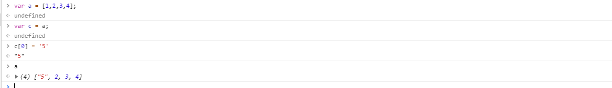
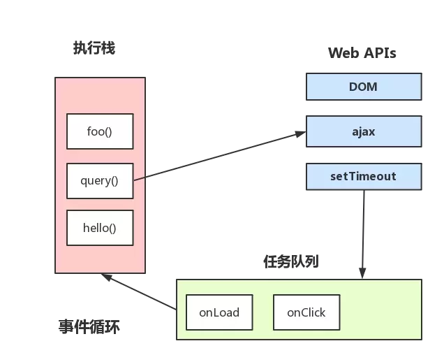
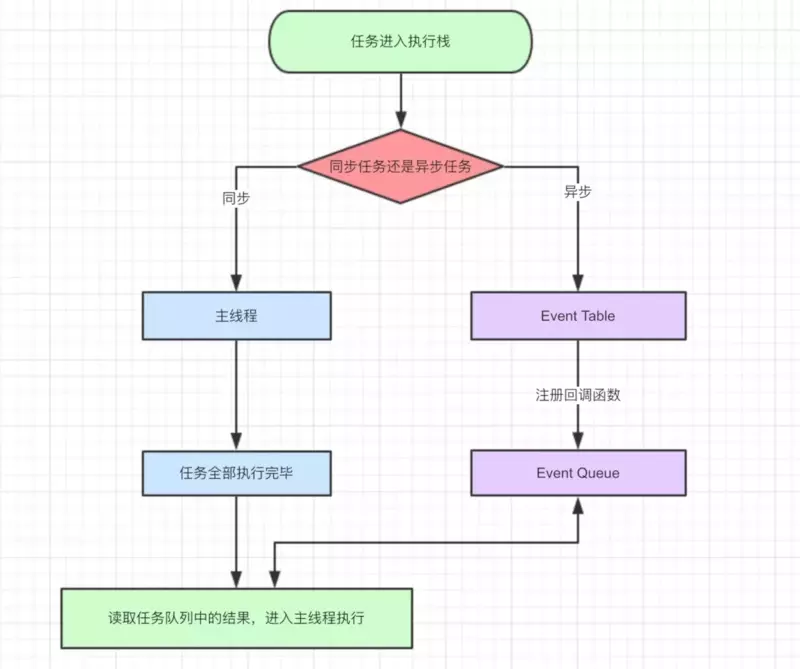
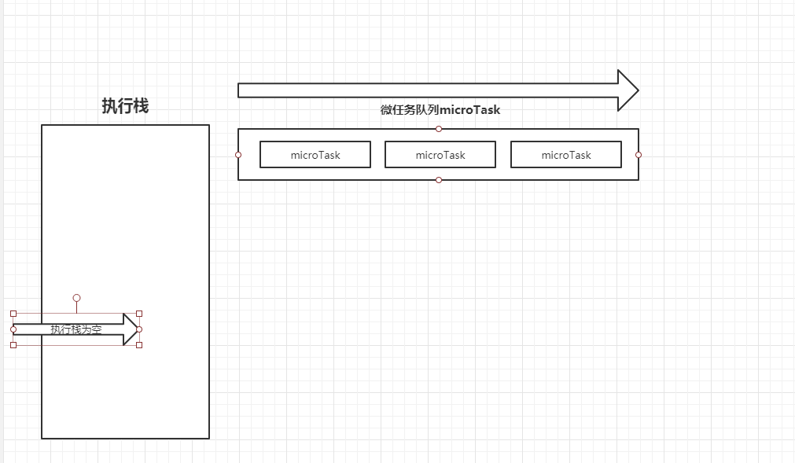

## call & apply & bind

`call`, `apply` 两者都能改变 `this` 的指向， 两者的区别在于 `call` 接受的 `arguments`, `apply` 接受的是 `array` `bind` 和 `call` 一致，但是 `bind` 返回的是一个函数

## 防抖与节流

在前端开发的过程中，我们经常会绑定一些持续触发的事件，如 `resize`, `scroll`, `mousemove` 等等， 但是我们并不希望在事件的持续触发的过程中频繁的去触发绑定方法，我们需要对这些事件进行节流或防抖

### 防抖

防抖是指在触发事件后在n秒内函数只执行一次， 防抖的事件一般是延时执行，需要立即执行的时候需要用节流

```js 
function debounce(fn, wait, immediate) {

/**
  * @fn 执行函数 
  * @wait 等待时间
  * @immediate Boolean 是否立即执行
*/

  if (!fn || typeof fn !== 'function') {
    throw new Error('请检查函数是否传递~~')
  }

  wait = wait || 300;

  let timeout = null;

  return function () {

    let context = this;
    let args = arguments;

    if (timeout) clearTimeout(timeout);

    if (immediate) {

      let _immediate = !timeout;

      timeout = setTimeout(() => {
        timeout = null;
      }, wait)

      if (_immediate) fn.apply(context, args);

    } else {
      timeout = setTimeout(() => {
        fn.apply(context, args);
      }, wait)
    }
  }
}

```

### 节流

节流是指连续触发事件但是在 n 秒中只执行一次函数

```js
function throttle(fn, wait) {
  let pervious = 0;
  return function () {
    let context = this;
    let args = arguments;
    let now = Date.now();

    if (now - pervious > wait) {
      fn.apply(context, args);
      pervious = now;
    }
  }
}
```

节流函数可以用 `timeout` 来实现， 其实就是防抖的立即执行

对于函数的节流和防抖，随便使用哪一个都可以达到我们预期的效果，如果你希望你的事件能够在n秒内立即执行，建议你使用防抖的立即执行模式或者节流模式

## 深拷贝

对于引用数据类型，`=` 操作符是将原数据的指针赋值给 `=` 左侧的变量，对左侧的变量进行修改，其引用的原有变量也会发生对应的更改

如下所示：



```js
function deepCopy(obj, cache = []) {
  function find(list, f) {
    return list.filter(f)[0]
  }
  if (obj === null || typeof obj !== 'object') {
    return obj
  }
  const hit = find(cache, c => c.original === obj)
  if (hit) {
    return hit.copy
  }
  const copy = Array.isArray(obj) ? [] : {}
  cache.push({
    original: obj,
    copy
  })
  Object.keys(obj).forEach(key => {
    copy[key] = deepCopy(obj[key], cache)
  })
  return copy
}
```

## 函数柯里化

”函数柯里化”是把接受多个参数的函数变换成接受一个单一参数（最初函数的第一个参数）的函数，并且返回接受余下的参数而且返回结果的新函数的技术。

```js
function add (x, y) {
  return x + y;
}

add(1, 2) // 3

function curryingAdd(x) {
  return y => x + y 
}

curryingAdd(1)(2) // 3
```

## 数组扁平化

`ES6` 中数据扁平化处理

1. flat 默认“拉平” 一层，如果想拉平`n`层数组，将`flat`中传递一个整数`n`,表示要拉平的层数，最大值为`Infinity`

```js
[1,[2,3], [[[3,4,5]]]].flat();
```

## Event loop

`event loop` 指的是事件循环机制，是浏览器或者 `nodeJS`的一种 `javascript` 解决单线程运行不会阻塞的一种处理机制；在程序中，主线程不断循环从"任务队列"中读取事件, 这种运行机制被称为Event Loop（事件循环）。



知识扩展：

`javascript` 是一个单线程脚本程序，主要用于和用户互动，操作 `DOM` 变化，在 `HTML5` 中提出了 `WEB WORKER` 标准，允许脚本创建多个线程，但是子线程还是受控于主线程，这些创建出的线程不能操作 `DOM`，同一时间还是只有一个线程操作`DOM`的变化。

任务队列：

`JS` 中的任务分为两种，一种是同步任务，一种是异步任务，异步任务不进入主进程，而是进入任务队列 `Task queue` 中, 只有任务对列“通知”了主线程，某个异步事件可以被执行了，当前任务才会进入主线程执行



微任务 & 宏任务

在`Task queue` 中，异步任务又被分为“宏任务” 和“微任务”，“微任务”的执行要早于“宏任务”，只有在“微任务”执行完毕后，才会去进一步的执行“宏任务”

常见的微任务

`process.nextTick(Node)`, `promise`, `MutationObserver`, `async await (generator的语法糖，主要还是promise)`

常见的宏任务

`setTimeout`, `setInterval`, `script`, `I/O`, `UI Rending`




案例

```js
console.log('script start')

async function async1() {
  await async2()
  console.log('async1 end')
}

async function async2() {
  console.log('async2 end') 
}

async1()

setTimeout(function() {
  console.log('setTimeout')
}, 0)

new Promise(resolve => {
  console.log('Promise')
  resolve()
})
.then(function() {
  console.log('promise1')
})
.then(function() {
  console.log('promise2')
})

console.log('script end')
```

`script start -> async2 end -> Promise -> script end` 同步任务执行完毕

`async1 end -> Promise1 -> Promise2` 微任务执行

`setTimeout` 宏任务执行

tips: `promise` 一经创建就会立马执行, `async await` 将异步事件转为同步事件执行

参考：[一次性弄懂Event loop](https://juejin.im/post/5c3d8956e51d4511dc72c200#heading-7)


## 发布/订阅

```js
var broadcast = {
    // 参数说明：如果 isUniq 为 true，该注册事件将唯一存在；如果值为 false或者没有传值，每注册一个事件都将会被存储下来
    on: function (name, fn, isUniq) {
        this._on(name, fn, isUniq, false);
    },
    // 通过调用 broadcast.once 注册的事件，在触发一次之后就会被销毁
    once: function (name, fn, isUniq) {
        this._on(name, fn, isUniq, true)
    },
    _on: function (name, fn, isUniq, once) {
        var eventData
        eventData = broadcast.data
        var fnObj = {
            fn: fn,
            once: once
        }
        if (!isUniq && eventData.hasOwnProperty(name)) {
            eventData[name].push(fnObj)
        } else {
            eventData[name] = [fnObj]
        }
        return this
    },
    // 参数说明：name 表示事件名，data 表示传递给事件的参数
    fire: function (name, data, thisArg) {
        var fn, fnList, i, len
        thisArg = thisArg || null
        fnList = broadcast.data[name] || []
        if (fnList.length) {
            for (i = 0, len = fnList.length; i < len; i++) {
                fn = fnList[i].fn
                fn.apply(thisArg, [data, name])
                if (fnList[i].once) {
                    fnList.splice(i, 1)
                    i--
                    len--
                }
            }
        }
        return this
    },
    data: {}
}
```

## 闭包

### 什么是闭包

1. 一个函数内部可以访问函数外部的变量
2. 引用的数据不会被垃圾回收机制回收

##  函数

函数包含有函数声明式和函数表达式

### 两者区别

变量和函数声明会被提升到作用域的顶端，函数声明式不存在变量提示，可能会被覆盖

### 自执行函数

1. 形如 `(function(() => { // to...do }))`;
2. 有一些函数前面加上 `~ +  - ! ()` 等符号，可以造成函数自执行;

形如（）、！、+、-、= 等运算符，都将函数声明转换成函数表达式，消除了javascript引擎识别函数表达式和函数声明的歧义，告诉javascript引擎这是一个函数表达式，不是函数声明，可以在后面加括号，并立即执行函数的代码，但是其中加（）是最安全的，不会和函数的返回值进行计算；

### 箭头函数

1. 当我们使用箭头函数的时候，箭头函数默认绑定最外层的 `this`, 箭头函数的 `this` 和 外层的 `this` 是一致的
2. 箭头函数的不存在作用域提升，需要在使用前定义
3. IE 11 及 更早 IE版本不支持箭头函数

### 构造函数

用 `new` 关键字来调用的函数，称为构造函数。

#### 构造函数的特点

1. 构造函数的函数名第一个字母通常大写
2. 函数体内使用`this`关键字，代表所生成的实例对象
3. 生成对象的时候，必须使用`new`命令来调用构造函数

#### new关键词都做了什么

1. 创建一个空对象，作为将要返回的对象实例
2. 将空对象的原型指向了构造函数的prototype属性
3. 将空对象赋值给构造函数内部的this关键字
4. 开始执行构造函数内部的代码

### 兼容不同浏览器环境

```js
! function (e, t) {
   // 检查上下文环境是否为Node                                                                            
   "object" == typeof exports && "object" == typeof module ?
     // 定义为普通Node模块
     module.exports = t() :
     // 检测上下文环境是否为AMD或CMD
     "function" == typeof define && define.amd ?
     // amd
     define([], t) :
     "object" == typeof exports ?
     // cmd
     exports.ajax = t() :
     // 将模块的执行结果挂在window变量中，在浏览器中this指向window对象
     e.ajax = t()
 }(this, function () {
   return function (e) {
     function t(r) {
       if (n[r]) return n[r].exports;
       var o = n[r] = {
         exports: {},
         id: r,
         loaded: !1
       };
       return e[r].call(o.exports, o, o.exports, t), o.loaded = !0, o.exports
     }
     var n = {};
     return t.m = e, t.c = n, t.p = "", t(0)
   }([])
 })
```


### ES6 Class

[传送门](http://es6.ruanyifeng.com/#docs/class)

## 排序算法

1. 冒泡排序

```js
function bubbing() {
  for (let i = 0; i < a.length; i++) {
    for (let j = i + 1; j < a.length; j++) {
      if (a[i] > a[j]) {
        let temp = a[i];
        a[i] = a[j];
        a[j] = temp;
      }
    }
  }
  return a;
}
```
2. 数组sort方法

从小到大： `a.sort((a,b) => a - b)`

从大到小： `a.sort((a,b) => b - a)`

